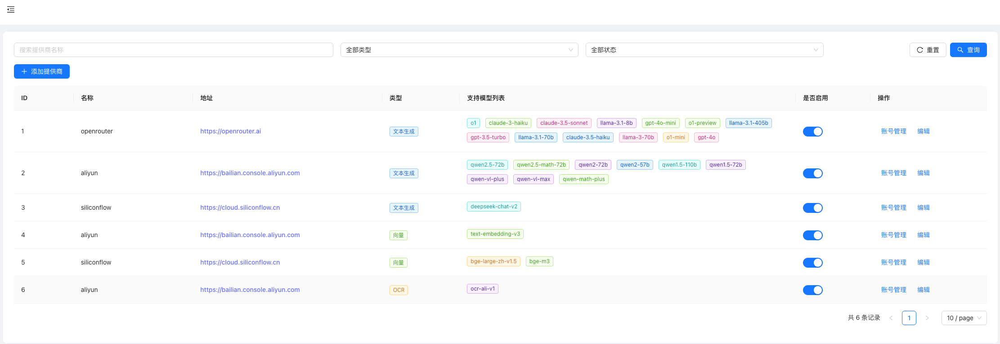

# OneAPI
[English](readme-en.md) | [中文](readme.md)

## Overview
OneAPI is an OpenAI proxy application designed to provide a unified LLM proxy service under the OpenAI protocol. It offers load balancing capabilities for multiple accounts of different third-party proxies based on a unified LLM model name. Additionally, it provides a user-friendly configuration interface.

## Main Dependency Versions
| Dependency     | Version   |
|----------------|-----------|
| JDK            | 21        |
| Spring Boot    | 3.2.1     |
| Vue            | 3.5.13    |

## Features
- Provides LLM proxy services and embedding proxy services based on the OpenAI protocol.
    - Supports adding mappings from standard model names to third-party proxy-specific model names in the configuration.
    - Supports configuring multiple accounts for a third-party proxy in the configuration, allowing load balancing between accounts.
    - Supports automatic circuit breaker capability for accounts that experience continuous exceptions, with recovery after a certain period.
    - Supports automatic balance updates for some third-party proxies (most third-party proxies do not provide balance query interfaces, so the balance field needs to be maintained manually) and supports DingTalk group notifications.
    - Allows specifying the third-party proxy and model to call using the format `provider:model_name`, for example, `openrouter:gpt-4o-mini`.
- Provides OCR proxy services based on Aliyun services. Currently, it only supports Alibaba Cloud's OCR service, and since there is no widely recognized protocol for OCR services, the OCR interface protocol is privately defined and can be modified according to needs.
- The application supports H2 and MySQL. Please modify the data source configuration in `application.properties` and package it accordingly.
    - On the first startup, the database will be automatically initialized. The initialization process includes creating necessary tables and inserting initial data.
    - The account data in the initialization data is purely test data and cannot be called. Please register third-party accounts and modify the account configuration.

## API Usage
Fully compatible with the OpenAI LLM proxy interface. Please refer to the [OpenAI LLM API documentation](https://platform.openai.com/docs/introduction).
- The API address for this application is `http://localhost:7001/v1`.
- You need to configure the API key in the `oneapi_config` table for API authentication. The default API key is `sk-oneapi-oneapi`. Currently, there is no configuration interface for this; please modify it directly in the database, supporting multiple API keys.
- Test code can be found in [TestModelApi.java](oneapi-start/src/test/java/com/supersoft/oneapi/api/TestModelApi.java).

## Basic Configuration
- Some application configurations are in the `oneapi_config` table; please modify them as needed.

| Configuration Key    | Example Value                                        | Description          |
|----------------------|------------------------------------------------------|----------------------|
| oneapi.model.default | claude-3-haiku                                       | Default model name   |
| oneapi.apiKeys       | ["sk-oneapi-oneapi"]                                 | API key              |
| log.enable           | true                                                 | Detailed log switch  |
| oneapi.alert.ding    | https://oapi.dingtalk.com/robot/send?access_token=xx | DingTalk alert robot |
| oneapi.success.rt    | 60000                                                | API timeout          |

## Configuration Page Description
### Third-Party Proxy Configuration List
- Click the `Enable` button to enable or disable the third-party proxy.
  

### Third-Party Proxy Detail Modification
- Click the `Edit` button in the third-party proxy configuration list to enter the detail modification page.
- You can modify the proxy name, proxy URL, model mapping, and third-party API proxy address on the page.
  

### Third-Party Proxy Account List
- Click the `Accounts` button in the third-party proxy configuration list to enter the account list page.
- Click the `Edit` button on the page to modify the account directly in-line.
- Click the `Add Account` button to add a new account.
- Click the `Enable` button to enable or disable the account.
  

## Secondary Development
### How to Build the Image
1. Build the front-end code
    ```bash
    cd oneapi-ui
    pnpm install
    pnpm run build
    ```
2. Build the back-end code
- After the code is compiled, the final generated fat jar will be copied to the docker directory for building the image.
    ```bash
    mvn clean package -Pdev
    ```
3. Build the image
    ```bash
    cd APP-META/docker-config
    docker build -t account/oneapi:tag .
    ```
## Deployment Methods

### Docker Deployment
1. Pull the Docker image:
    ```bash
    docker pull supermicroai/oneapi:20241223
    ```
2. Run the Docker container:
    ```bash
    docker run -d -p 7001:7001 supermicroai/oneapi:20241223
    ```

### Kubernetes Deployment
1. Modify the `image` field in the deployment file [app.yaml](APP-META/app.yaml) to the compiled image address.
2. Apply the deployment file:
    ```bash
    kubectl apply -f app.yaml
    ```
