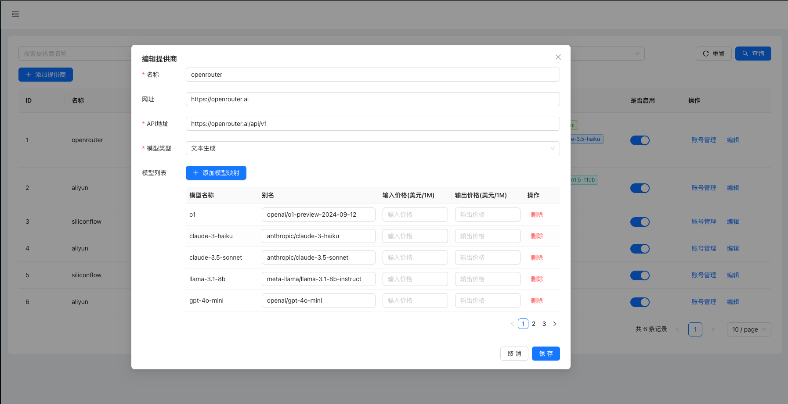
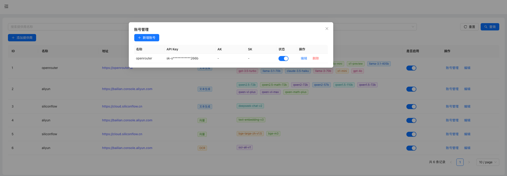

# OneAPI
[English](readme.md) | [中文](readme-cn.md)

## Overview
OneAPI is an OpenAI proxy application designed to provide LLM proxy services under a unified OpenAI protocol. It offers load balancing and fault tolerance capabilities for multiple accounts of different third-party proxies based on a unified LLM model name. Additionally, it provides a user-friendly configuration interface.
## Main Dependency Versions
| Dependency     | Version   |
|----------------|-----------|
| JDK            | 21        |
| Spring Boot    | 3.2.1     |
| Vue            | 3.5.13    |

## Features
- Provides LLM proxy services and embedding proxy services based on the OpenAI protocol.
    - Supports adding mappings from standard model names to third-party proxy-specific model names in the configuration.
    - Supports configuring multiple accounts for a third-party proxy in the configuration, allowing load balancing between accounts.
    - Supports automatic circuit breaker capability for accounts that experience continuous exceptions, with recovery after a certain period.
    - Supports automatic balance updates for some third-party proxies (most third-party proxies do not provide balance query interfaces, so the balance field needs to be maintained manually) and supports DingTalk group notifications.
    - Allows specifying the third-party proxy and model to call using the format `provider:model_name`, for example, `openrouter:gpt-4o-mini`.
    - Provides OCR proxy services based on Aliyun services. Currently, it only supports Alibaba Cloud's OCR service, and since there is no widely recognized protocol for OCR services, the OCR interface protocol is privately defined and can be modified according to needs.
    - The application supports H2, MySQL, and PostgreSQL databases. Please modify the data source configuration in `application.properties` and package it accordingly.
    - On the first startup, the database will be automatically initialized. The initialization process includes creating necessary tables and inserting initial data.
    - The account data in the initialization data is purely test data and cannot be called. Please register third-party accounts and modify the account configuration.

## Database Configuration

The application supports three database types:

### H2 Database (Default)
H2 is used by default for development and testing. No additional configuration is required.

```properties
# H2 database configuration (default)
spring.datasource.url=jdbc:h2:file:./data/oneapi;AUTO_RECONNECT=TRUE
spring.datasource.driver-class-name=org.h2.Driver
spring.datasource.username=sa
spring.datasource.password=password
```

### MySQL Database
For production environments, MySQL is recommended.

```properties
# MySQL database configuration
spring.datasource.url=jdbc:mysql://localhost:3306/oneapi?useUnicode=true&characterEncoding=utf8&useSSL=false&serverTimezone=Asia/Shanghai
spring.datasource.driver-class-name=com.mysql.cj.jdbc.Driver
spring.datasource.username=root
spring.datasource.password=password
```

### PostgreSQL Database
PostgreSQL is also supported for production environments with advanced features.

```properties
# PostgreSQL database configuration
spring.datasource.url=jdbc:postgresql://localhost:5432/oneapi
spring.datasource.driver-class-name=org.postgresql.Driver
spring.datasource.username=postgres
spring.datasource.password=password
```

### Database Setup Instructions

1. **Choose your database**: Comment out the current database configuration and uncomment the desired database configuration in `application.properties`
2. **Create database**: Create a database named `oneapi` in your chosen database system
3. **Start application**: The application will automatically detect the database type and initialize the schema

**Note**: The application will automatically create all necessary tables and insert initial data on first startup. No manual database setup is required.

## API Usage
Fully compatible with the OpenAI LLM proxy interface. Please refer to the [OpenAI LLM API documentation](https://platform.openai.com/docs/introduction).
- The API address for this application is `http://localhost:7001/v1`.
- You need to configure the API key in the `oneapi_config` table for API authentication. The default API key is `sk-oneapi-default-token-2024`. 
- Test code can be found in [TestModelApi.java](oneapi-start/src/test/java/com/supersoft/oneapi/api/TestModelApi.java).

## Basic Configuration
- Some application configurations are in the `oneapi_config` table; please modify them as needed.

| Configuration Key    | Example Value                                        | Description          |
|----------------------|------------------------------------------------------|----------------------|
| oneapi.model.default | claude-3-haiku                                       | Default model name   |
| log.enable           | true                                                 | Detailed log switch  |
| oneapi.alert.ding    | https://oapi.dingtalk.com/robot/send?access_token=xx | DingTalk alert robot |
| oneapi.success.rt    | 60000                                                | API timeout          |

## Configuration Page Description
### Third-Party Proxy Configuration List
- Click the `Enable` button to enable or disable the third-party proxy.
  

### Third-Party Proxy Detail Modification
- Click the `Edit` button in the third-party proxy configuration list to enter the detail modification page.
- You can modify the proxy name, proxy URL, model mapping, and third-party API proxy address on the page.
  

### Third-Party Proxy Account List
- Click the `Accounts` button in the third-party proxy configuration list to enter the account list page.
- Click the `Edit` button on the page to modify the account directly in-line.
- Click the `Add Account` button to add a new account.
- Click the `Enable` button to enable or disable the account.
  
